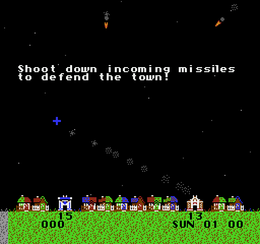

# NES Emulator



A Nintendo Entertainment System emulator written in Rust: 6502 CPU, PPU, APU
and six cartridge mappers, with a desktop SDL2 frontend and a WebAssembly
build that runs in the browser.

The core has no platform dependencies (no SDL, no filesystem), so the same
code drives both frontends.

## Accuracy

Checked against the community-standard test ROMs in `tests/roms/`
(`cargo test --release`):

| Test ROM | What it checks | Result |
|----------|----------------|--------|
| `nestest` | Every official + unofficial opcode; registers **and cycle counts** compared line-by-line with the 8,991-line golden log | Pass |
| blargg `instr_test-v5` (official + all) | Behaviour of all 256 opcodes, including unofficial ones | Pass |
| blargg `instr_misc` | Dummy reads, page-cross behaviour | Pass |
| blargg `apu_test` (8 subtests) | Length counters, frame IRQ timing and jitter, DMC | Pass |
| blargg `ppu_open_bus` | PPU I/O latch and its decay | Pass |
| blargg `oam_read` | Sprite memory reads | Pass |
| blargg `mmc3_test` 1, 2, 3, 5 | MMC3 counter clocking, A12 edge detection, IRQ behaviour | Pass |
| blargg `mmc3_test` 4 (scanline timing) | Exact IRQ dot within a scanline | Partial: checks 1–8 of 10 |
| blargg `ppu_vbl_nmi` | VBL flag and NMI timing to the PPU dot | Partial: 4 of 10 subtests |

The two partial results come from the same limitation. The CPU advances the
PPU 3 dots per bus access instead of interleaving at single-dot granularity,
so NMI and MMC3 IRQ timing can be off by 1–2 dots. That's invisible in games
but measurable by these tests, which are marked `#[ignore]` with the reason.

## Quick start

```bash
# macOS: brew install sdl2
cargo run --release -- roms/thwaite.nes
```

On Windows, build SDL2 from source instead (needs [CMake](https://cmake.org/download/)):

```powershell
cargo run --release --features bundled -- roms\thwaite.nes
```

### Play in the browser

```bash
./web/build.sh                          # → web/dist/ (72 KB .wasm + JS + ROMs)
python3 -m http.server -d web/dist 8000 # open http://localhost:8000
```

The browser build uses raw C-ABI exports (`web/src/lib.rs`) and
`WebAssembly.instantiate`, so there's no wasm-bindgen or bundler. `web/nes-player.js`
handles 60.1 Hz frame pacing, AudioWorklet audio, keyboard and touch input, and
drag-and-drop ROM loading.

## Controls

| NES | Keys |
|-----|------|
| D-pad | Arrow keys or WASD |
| A | `Z` (desktop also `Alt`; browser also `K`) |
| B | `X` (desktop also `Ctrl`; browser also `J`) |
| Start | `Enter` or `Space` |
| Select | `Shift` or `Tab` |

Desktop only: `F5` reset, `[` / `]` volume, `Escape` quit. Player 2 uses the
numpad: `8` `5` `6` `9` for Up/Down/Left/Right, `1` A, `2` B, `3` Select, `4` Start.

## Included games

`roms/` has three open-source homebrew games (GPL-3.0; authors and source
links in [`roms/ROMS.md`](roms/ROMS.md)):

| File | Game | Mapper |
|------|------|--------|
| `thwaite.nes` | Thwaite: missile defense | 0 (NROM) |
| `nova.nes` | Nova the Squirrel: platformer, battery save | 1 (MMC1) |
| `croom.nes` | Concentration Room: puzzle | 0 (NROM) |

Any other `.nes` file works too (`cargo run --release -- path/to/game.nes`).
Battery-backed saves are written next to the ROM as `game.sav`.

## Supported mappers

| Mapper | Board | Examples |
|--------|-------|----------|
| 0 | NROM | Super Mario Bros., Donkey Kong, Balloon Fight |
| 1 | MMC1 | The Legend of Zelda, Metroid, Mega Man 2 |
| 2 | UxROM | Mega Man, Castlevania, Contra |
| 3 | CNROM | Gradius, Paperboy, Arkanoid |
| 4 | MMC3 | Super Mario Bros. 2 & 3, Kirby's Adventure, Mega Man 3–6 |
| 7 | AxROM | Battletoads, Marble Madness |

## How it works

```
src/
├── lib.rs               # Core crate: re-exports Emulator, buttons, screen size
├── emulator.rs          # Instruction loop, interrupt polling, OAM DMA
├── bus.rs               # CPU address decode; each access clocks PPU ×3 + APU
├── cpu/mod.rs           # 2A03 (6502): all 256 opcodes, dummy reads/writes
├── ppu/mod.rs           # Loopy scrolling, sprite evaluation, open bus, VBL/NMI
├── apu/                 # 2 pulse, triangle, noise, DMC (with memory reader + IRQ)
├── cartridge/           # iNES loader; mappers 0/1/2/3/4/7
├── controller/mod.rs    # Strobe latch + serial shift register
├── main.rs              # SDL2 frontend (desktop)
└── ui.rs                # Status bar: buttons, FPS, volume
web/                     # WebAssembly build + browser player
examples/snapshot.rs     # Headless: run N frames with scripted input, save a PPM
tests/test_roms.rs       # Accuracy suite (the table above)
```

Design notes:

- **Bus-level clocking.** Every CPU read or write first advances the PPU 3 dots
  and the APU 1 cycle, so a `$2002` read mid-instruction sees the PPU where
  real hardware would. Internal cycles with no bus access are made up after
  each instruction.
- **Hardware side effects.** Indexed addressing performs the 6502's dummy read
  of the un-carried address, and read-modify-write instructions write the
  original value back before the result. MMC1 relies on the latter: it
  ignores the second of two back-to-back writes.
- **Interrupts.** /IRQ is a level-triggered line (APU frame counter, DMC,
  MMC3), polled before an instruction's last cycle like the real CPU. MMC3
  counts filtered rising edges on PPU address line A12, which is what lets
  status bars and split-screen effects land on the right scanline.
- **No shared ownership.** The `Bus` owns every component, with no
  `Rc<RefCell<…>>`.
- **Frame pacing.** Both frontends pace to the NES's own 60.0988 Hz against the
  wall clock, so a 120 Hz display doesn't double the game speed.

## Adding a mapper

1. Add `src/cartridge/mappers/mapperNNN.rs` implementing the `Mapper` trait
   (override `scanline()` / `irq_active()` if it counts scanlines).
2. Register it in `MapperEnum`, `dispatch!` and `impl_from!` in `mappers/mod.rs`.
3. Construct it for its iNES number in `Cartridge::from_ines`.

## Debug logging

```bash
RUST_LOG=info cargo run --release -- rom.nes
```
